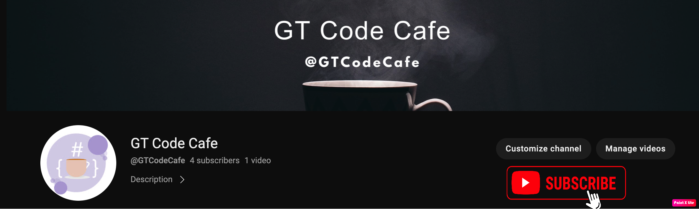

# docker-youtube-series
This repo is intended for people who want to learn docker from scratch , we will be using AWS and MacBook local as out deployment environment

Visit my youtube channel [GtCodeCage](https://www.youtube.com/channel/UCbtpE4JlXiMH-uYtE-5p_6A) and subscribe

| Technology | Topic + Youtube URL | Read Me File
| ------ | ------ | ---|
| AWS EC2 | [AWS EC2 creation for docker installation](https://www.youtube.com/watch?v=-xIQZPq0XDc) | You are in the current file
| Docker | [Install Docker on EC2](https://www.youtube.com/watch?v=FXWkqdo_7qQ) |  [README.md](https://github.com/gdwntheophilus/docker-youtube-series/tree/main/series-01-install-docker-on-ec2)
| Docker | Docker Command Line Interface | Expect updated soon
| Docker| Create Docker Containers | Expect updated soon
| Docker | States of Docker Containers | Expect updated soon
| Docker | Getting Inside Docker Container | Expect updated soon
| Docker | Inspect Docker Containers | Expect updated soon
| Docker | Docker Container Logs | Expect updated soon
| Docker | What is Dockerfile | Expect updated soon
| Docker | Create Image Using Dockerfile | Expect updated soon
| Docker | Docker Images / Where are the images Stored | Expect updated soon
| Docker | Inspecting Docker Images | Expect updated soon
| Docker | Storage Drivers & Volumes | Expect updated soon
| Docker | Docker Create Volumes | Expect updated soon
| Docker | Docker Network | Expect updated soon
| Docker | Docker Swarm | Expect updated soon
| Docker | Create Docker Swarm | Expect updated soon
| Docker | Docker Service | Expect updated soon
| Docker | Docker Swarm, Creating replicas | Expect updated soon
| Docker | Docker Resource Usage | Expect updated soon
