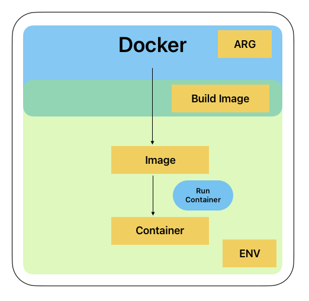

# Docker File
In this section we are going to see what is docker file and how can use the docker file to create images

# Docker file

```]
RUN command in the shell form, we can use a \ (backslash) to continue a single RUN instruction onto the next line.

LABEL: The LABEL instruction adds metadata to an image

CMD: The CMD command has some similarities with the RUN command discussed earlier.

ENTRYPOINT: It states what will happen every time a container is created using the image. 

ADD: The ADD command just copies the files from the source (on the host) to the destination (containers filesystem). 

COPY: Copy will copy the local file to the docker image

ENV: Environment variable substitution will use the same value for each variable throughout the entire instruction

ARG: An ARG declared before a FROM is outside of a build stage, so it can’t be used in any instruction after a FROM. To use the default value of an ARG declared before the first FROM use an ARG instruction without a value inside of a build stage:

EXPOSE: The EXPOSE instruction just lets Docker know about the ports on which the container will listen at runtime. By default, the protocol is TCP, although the UDP protocol may also be specified.

WORKDIR: The WORKDIR directive sets out the working directory for any RUN, CMD, ENTRYPOINT, COPY, and ADD instructions that will follow in the Dockerfile. 

USER: The USER directive is very straightforward. It is used to set the UID (or username) or optionally the group of the user (GID) to be used when running the container created from the image based on any RUN, CMD, and ENTRYPOINT instructions that follow it in the Dockerfile.

VOLUME: The VOLUME instruction simply creates a mount point with the specified name. We can write the value of the volume as a JSON array or just as a plain string. The docker run command will initialize the newly created volume.
```

# Sample Dockerfile
- Docker file sample for http server
```docker
ARG image=ubuntu
FROM ${image} 
ENV workdir=/var/www/html
RUN apt-get update 
RUN apt-get install -y apache2 
RUN apt-get install -y apache2-utils 
RUN apt-get clean 
WORKDIR ${workdir}
EXPOSE 80 
CMD ["apache2ctl", "-D", "FOREGROUND"]
```



- Docker command to build the file
``` bash
docker build -t myfirstimage .
```
- Docker command to run out image
``` bash
docker run -p 80:80 myfirstimage
```

- How can we pass build variable
``` bash
docker build -t myfirstimage --build-arg imagename=ubuntu .
```

- Attaching a volume and testing if appearing on browser
``` bash
docker run -p 80:80 -v /User/godwin/docker/volume:/var/www/html myfirstimage
```