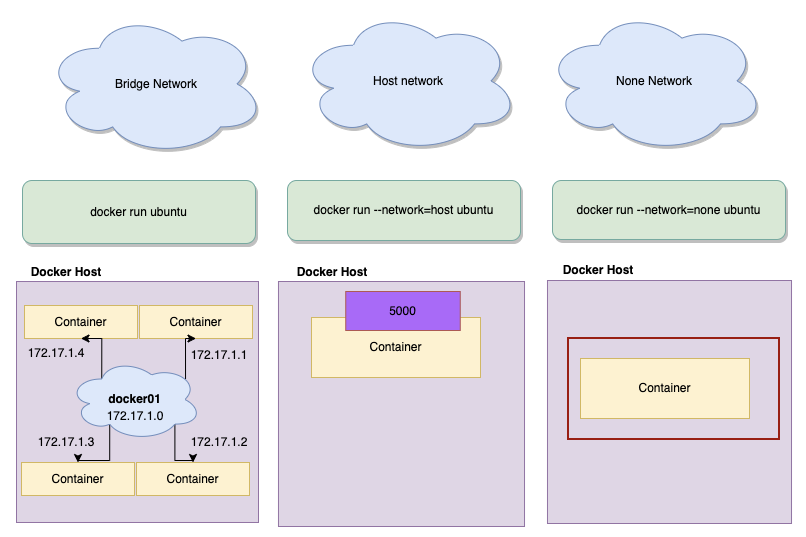

# Docker Network
In this tutorial we are going to see about docker network

### Docker network types

|Driver Type | Description
|---|----|
|bridge: |The default network driver. If you don’t specify a driver, this is the type of network you are creating. Bridge networks are usually used when your applications run in standalone containers that need to communicate. See bridge networks.
|host: |For standalone containers, remove network isolation between the container and the Docker host, and use the host’s networking directly. See use the host network.
|overlay: |Overlay networks connect multiple Docker daemons together and enable swarm services to communicate with each other. You can also use overlay networks to facilitate communication between a swarm service and a standalone container, or between two standalone containers on different Docker daemons. This strategy removes the need to do OS-level routing between these containers. See overlay networks.
|ipvlan: |IPvlan networks give users total control over both IPv4 and IPv6 addressing. The VLAN driver builds on top of that in giving operators complete control of layer 2 VLAN tagging and even IPvlan L3 routing for users interested in underlay network integration. See IPvlan networks.
|macvlan: |Macvlan networks allow you to assign a MAC address to a container, making it appear as a physical device on your network. The Docker daemon routes traffic to containers by their MAC addresses. Using the macvlan driver is sometimes the best choice when dealing with legacy applications that expect to be directly connected to the physical network, rather than routed through the Docker hosts network stack. See Macvlan networks.
|none: |For this container, disable all networking. Usually used in conjunction with a custom network driver. none is not available for swarm services. 




## How to create docker network

- Bridge Network
```docker
docker network create -d bridge mybridge
```

- Host Network
```docker
docker network create -d host myhost
```

## Inspecting Docker Networks

- command to inspect docker networks
```docker 
docker network inspect mybridge
docker network inspect brige
docker network inspect host
docker network inspect none
```

##
```docker
docker run -d --name test1 --network mybridge busybox sh -c "while true;do sleep 3600;done"

docker run -d --name test2 --network mybridge busybox sh -c "while true;do sleep 3600;done"

docker exec -it test1 sh
```


